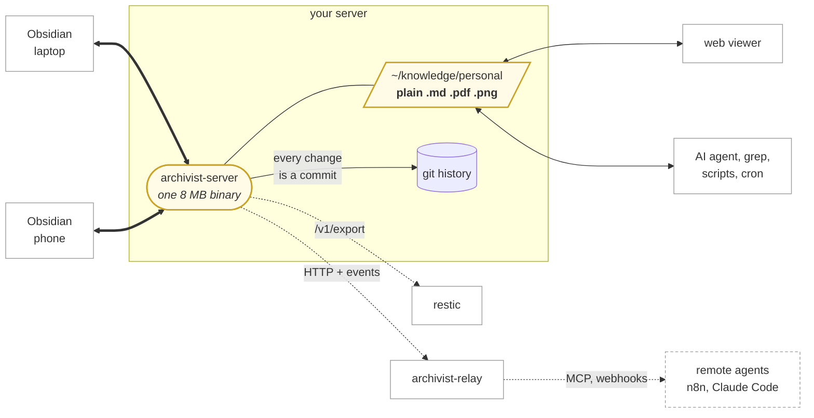

# Archivist

Keep using Obsidian. Keep your notes as ordinary files on your own server.

Obsidian is a good editor and a bad place to store the only copy of a decade of
thinking. Its own sync is a subscription, and the self-hosted alternatives all
ask for something back: the server copy stops being ordinary files, or sync is
not real-time, or mobile is unreliable, or your vault ends up stored three times
over.

Archivist is a small Go server and an Obsidian plugin. Your vault lives on your
server as **plain Markdown, images and PDFs in a normal directory** — the real
thing, not an export — while Obsidian on your laptop and phone syncs against it
in the background.

| | | |
| --- | --- | --- |
| `archivist-server` | owns the vault, keeps the history | **working** |
| Obsidian plugin | syncs your laptop and phone | **working** |
| `archivist-relay` | optional sidecar: MCP tools, webhooks, a friendlier API | **working** |

The relay is for reaching the vault from somewhere that is *not* the server. If
your tools run on the same machine, you do not need it — the vault is a
directory, and opening a file beats calling an API.

## Why that matters

Because a directory of files is useful to everything else you own.

```bash
grep -ri "that idea from 2019" ~/knowledge/personal
```

Point a web viewer at it. Let an AI agent read and write notes in it. Run a
script over it. Serve it. Back it up with the same tool as everything else. None
of that needs an adapter, an API client, or an export step, because there is
nothing to adapt — they are just files.

Every change is committed to git, so you get history and point-in-time restore
for free, and can recover a note you mangled three weeks ago.

## How it flows



**Thick lines** are sync. **Thin lines are ordinary file I/O** — that is the
whole point: anything on the server opens files rather than calling an API.
Dotted lines are optional.

## What this is good for

**Capture anywhere, file it later.** Jot into a capture app on your phone; a
small job on the server writes the keepers into `Inbox/` as Markdown. Your
laptop has them the next time you open Obsidian.

**Let an AI agent actually use your notes.** An agent on the server reads and
writes the vault as files — no API client, no export, no sync SDK. It can answer
"what did I decide about X in 2019" by grepping, and file its own notes back
into the vault where you will see them on your phone.

**React to changes.** Subscribe to `/v1/events`, and when a note changes,
re-embed it, update an index, run a linter, post to a channel. The cursor in
`/v1/changes` means a consumer that was down for a week catches up correctly.

**Read your notes on the web** without another sync system. Point any viewer at
the directory. Read-only is safest, since server-side edits cannot be merged.

**Generate notes from scripts.** A cron job writing a daily note, a job pulling
in your calendar, a script filing receipts. Write a file, and it is on your
phone a second later.

**Search across everything, with normal tools.** `grep`, `rg`, `fzf`, and every
Unix thing you already know, over the actual files.

**Keep history without thinking about it.** Every change is a commit, so
"restore the version from before I deleted half of it" is always available.

## Philosophy

**Small enough to read in an afternoon.** ~3,000 lines across both halves. If it
grows past what one person can hold in their head, it has failed at its purpose.

**One static binary. No database, no dependencies.** The container image is
`FROM scratch` and 8 MB. Nothing to install on the server, nothing to keep
running alongside it. The relay is a separate binary precisely so a laptop never
carries a git implementation it will not use.

**The server-side files are real and yours to modify.** Edit them with anything.
The changes sync back to your devices.

**Boring where it counts.** Git stores the history. Standard three-way merge
resolves conflicts. Content is addressed by git's own object hash, so you can
verify it with `git hash-object`.

## Caveats — read these before trusting it

**Single user.** No accounts, no sharing, no permissions. One person, one token
per vault.

**Not for the public internet.** It expects to sit behind Tailscale, a VPN, or
a private network. There is one bearer token and no rate limiting, lockout, or
audit log.

**Conflicts are resolved, not prevented.** Edit the same lines on two devices and
you get both versions — the server's, plus yours in a `.conflict-<device>-<time>`
file next to it. Nothing is lost, but you resolve it by hand.

**Editing on the server is last-writer-wins.** A push from Obsidian carries a
base version, so it can be merged. A program writing directly to the directory
does not, so if you leave a note open in a web editor for a day and then save,
it overwrites what your phone wrote. Git history has the overwritten version,
but nothing warns you. Keep server-side editors read-mostly.

**It is new.** Written in 2026, used by one person. It is well tested, including
against the real thing rather than mocks — but you should keep backups you have
actually tried restoring, which is true of any sync tool and especially this one.

## Alternatives

| | Cost | Server copy | Real-time | Mobile |
| --- | --- | --- | --- | --- |
| **Obsidian Sync** | subscription | none — hosted | yes | excellent |
| **Self-hosted LiveSync** | free | a projection of a CouchDB, ~4× disk | yes | good |
| **Obsidian Git** | free | a git checkout | no — on a timer | poor on iOS |
| **Syncthing** | free | plain files | yes | no iOS client |
| **Archivist** | free | **plain files, 1×** | yes | good |

**Obsidian Sync** is the right answer if you want it to just work and do not
care where the notes live. It is genuinely excellent.

**Self-hosted LiveSync** is the mature self-hosted option and does more than
this: end-to-end encryption, peer-to-peer, several storage backends. Choose it
if you want a project with many users behind it. The trade is that CouchDB is
the real store and the filesystem copy is a projection maintained by a separate
daemon — measured at about 4× the vault size across the three copies, and the
server cannot arbitrate conflicts because every client is a full replica.

**Obsidian Git** is the closest in spirit and the simplest thing that works. It
syncs on a timer rather than on save, every device carries the full history, and
iOS support is its weakest point.

**Syncthing** is excellent and has no iOS client, which ends the discussion if
you have an iPhone.

## Getting started

Server — grab a binary from [releases](../../releases) or run the container:

```bash
ARCHIVIST_TOKEN=$(openssl rand -hex 32) \
  archivist-server -vault ~/knowledge/personal -git ~/archivist/git
```

Plugin — install [BRAT](https://github.com/TfTHacker/obsidian42-brat) from
Community Plugins, add `pkronstrom/obsidian-archivist` as a beta plugin, then set the
server URL and token in archivist's settings and press **Test connection**.

### Connecting a vault that already has notes

Getting started assumes an empty vault on one side. When both sides have
content, the plugin stops on the first sync and asks, because the union of two
unrelated vaults is not something you can undo by pressing something.

| This device | The server | What happens | Do this |
|---|---|---|---|
| Empty | Empty | nothing to do | — |
| Empty | Has notes | pulls everything | nothing; this is second-device onboarding |
| Has notes, never synced | Empty | pushes everything | nothing; this is the first bootstrap |
| **Has notes, never synced** | **Has notes** | **stops and asks** | pick one of the three below |
| Already synced | a *different* vault | refuses, touches nothing | fix the URL, or use **Re-bootstrap from server** |
| Already synced | same vault, new hostname | works | nothing; the plugin records the vault, not the host |

The three choices, when it asks:

- **Adopt server** — this vault's files move into a dated
  `_archivist-rescued-…/` folder and the server's version is pulled. Nothing is
  deleted, and because the folder is inside the vault it syncs to your other
  devices too. Adopting twice never disturbs an earlier rescue.
- **Publish local** — this vault is pushed over the server's. It needs no rescue
  folder: every version of every server file is already in git history. Files
  only the server has are kept and arrive on the next sync.
- **Merge anyway** — the union of both. Same-name files on both sides become
  conflict pairs to resolve by hand.

Nothing is written until you choose, and dismissing the dialog changes nothing.

### More than one vault

One server, one relay and one hostname serve every vault. Vaults are
directories:

```
$ROOT/vaults/personal/       the vault: plain Markdown and attachments
$ROOT/vaults/work/
$ROOT/.archivist/personal/   its history, never inside the vault
$ROOT/.archivist/work/
```

Addressing is path-qualified, so a vault is visible in every log line and every
curl:

```bash
curl -H "Authorization: Bearer $TOKEN" https://vault.example/v1/vaults
curl -H "Authorization: Bearer $TOKEN" https://vault.example/personal/v1/head
```

`GET /v1/vaults` returns **only what your token opens**, which is both the
picker and the authorisation check. A token used against a vault it does not
open gets 403; one that does not exist gets 404.

Names are one path segment, no leading dot, no `/` and no `..`. `MyVault` and
`My Own Vault` are both legal — the second is `My%20Own%20Vault` in a URL, which
the plugin handles and a human writing curl must remember, so URL-safe names are
easier by hand. A name that matches an existing one after Unicode NFC
normalisation is refused: `työ` from a Mac and `työ` from a phone would
otherwise be two directories that look identical and serve different content.

Vault creation is off by default and is a capability on the token, never given
to a relay or agent token:

```bash
curl -X POST -H "Authorization: Bearer $ADMIN_TOKEN" \
     -d '{"name":"archive"}' https://vault.example/v1/vaults
```

`ARCHIVIST_MAX_VAULTS` (default 5) refuses creation past a limit. Finding more
than that already on disk warns and serves them all, so raising it is always a
way out.

A vault directory added while the server runs appears without a restart —
discovery re-scans behind a short cache.

### Minting tokens

Tokens live in the file named by `ARCHIVIST_TOKENS`, and are minted rather than
hand-written — they are stored hashed, so there is nothing to type in by hand:

```bash
docker compose exec archivist archivist-server token add \
  -label mac -vaults personal -scopes read,write

docker compose exec archivist archivist-server token list
docker compose exec archivist archivist-server token revoke <id-prefix>
```

A token carries the vaults it opens and the verbs it holds: `read`, `write`,
`delete`. `-expires-in 720h` gives it a deadline; `-can-create-vaults` lets it
create one.

`token add` prints the secret **once**. It is stored as a sha256 hash and cannot
be read back — losing it means minting another. The running server picks up the
change without a restart.

A token without `write` must not go into the Obsidian plugin: it will sync down
and then fail on the first save. `token add` warns when it mints one.

Without `ARCHIVIST_TOKENS`, `ARCHIVIST_TOKEN` opens **every** vault with read and
write. That is the one-vault convenience, not isolation — it is exactly what a
leaked agent token would give away — and the server says so once at startup.

In the plugin, **Server URL** and **Vault** are two separate fields. A device
switches vault by editing one of them. There is deliberately no compatibility
alias for the old unqualified paths: an un-updated device gets a 404, which is
visible, rather than writing into the wrong vault, which is not.

### Reaching it from elsewhere

Everything on the server uses the files directly. For anything that is not on
the server — an agent on your laptop, an n8n flow in another container —
`archivist-relay` offers MCP over HTTP, webhook fan-out and a friendlier write
API, holding no vault and no sync state of its own.

```
archivist-relay -url http://archivist:8090 -token "$ARCHIVIST_TOKEN" \
                -relay-token "$RELAY_TOKEN" -listen :8091
```

Writing a note is `curl -T`, and reading one gives you an `ETag`:

```
curl -T note.md -H "Authorization: Bearer $RELAY_TOKEN" \
     localhost:8091/file/notes/idea.md
```

**If you read a note before editing it, send its ETag back as `If-Match`.**
Without it the write is a blind overwrite and a change that landed in between is
lost rather than merged. The MCP tools do the same thing with the `revision`
that `read_note` returns and `write_note` accepts. `GET /` on the relay
describes the rest.

The server's own HTTP API remains directly usable; `GET /v1` describes it.

## Hooking things up to it

Because every change is a commit, **history is already a durable event feed**.
Anything that wants to react to edits — an indexer, an AI agent, a webhook
bridge — stores a cursor and asks what it missed:

```bash
curl -s -H "$AUTH" "https://vault.example/v1/changes?since=$CURSOR"
```

That works however long the consumer was away, so there is nothing to queue and
no backlog to manage.

For low latency, subscribe to the change stream:

```bash
curl -N -H "$AUTH" https://vault.example/v1/events
data: {"head":"4ff143d6..."}
```

It carries a **notification, not the change** — "something moved, go look". A
missed event costs nothing, because the cursor still says what changed. Use the
stream to know *when*, and `/v1/changes` to know *what*.

Each event carries enough to triage without a follow-up call:

```json
{ "head": "ff5a0b52...", "prev": "4f3538ca...", "count": 2, "changes": [
  { "path": "att/scan.pdf",  "op": "put", "ext": "pdf", "kind": "binary", "size": 3000,  "hash": "0dc8eb..." },
  { "path": "notes/idea.md", "op": "put", "ext": "md",  "kind": "text",   "size": 11,    "hash": "a1988d..." } ] }
```

`kind` is sniffed from the content, not guessed from the name, so an agent can
skip what it cannot read. A commit touching more than 100 files is truncated
with a count — read `/v1/changes` for those.

`/v1/changes` returns the **same shape**, so a consumer can use the stream and
the catch-up path interchangeably.

[`examples/watch-vault.py`](examples/watch-vault.py) is a working consumer in
~120 lines of standard library — subscribe, triage, act, reconnect, resume from
the cursor. Adapt the `handle()` function and you have an agent.

An agent on the same machine should read the changed files straight off disk
rather than fetching them; the vault is an ordinary directory.

## Importing an existing vault

Copy it in and start the server:

```bash
rsync -a ~/existing-vault/ ~/knowledge/personal/
archivist-server -vault ~/knowledge/personal ...
```

Then point each device at it. **Files that already match are recognised by hash
and never transferred**; files only one side has move across; files that
genuinely differ merge, or become a conflict pair. There is no import command
because there is nothing for one to do.

One caveat with accented filenames: macOS writes them decomposed and Linux
tools write them composed, and those are different bytes — so `Kronström.md`
seeded from a Linux box and `Kronström.md` from a Mac would be two notes. Seed
from the machine that owns the vault and it stays consistent.

## Syncing Obsidian's own config

Off by default. Each device chooses its own level in the plugin's settings, and
that choice is never itself synced — a phone can stay on **Files only** while a
laptop syncs everything.

| Level | What travels |
|---|---|
| **Files only** | notes and attachments; no config at all |
| **Files + appearance** | `app.json`, `appearance.json`, `hotkeys.json`, `snippets/*.css`, `themes/*/` |
| **Files + appearance + plugins** | the above, plus `community-plugins.json`, `core-plugins.json`, and any plugin's `data.json` you turn on individually |

Never, at any level:

| Never syncs | Why |
|---|---|
| `workspace.json`, `workspace-mobile.json` | per-device by nature; a synced layout fights across screens |
| `graph.json`, caches, anything unlisted | per-device, and an allowlist fails safe |
| plugin **code** (`main.js`, `manifest.json`, `styles.css`) | ~50 MB a year of binary churn, unrecoverable except by prune |
| `plugins/*/data.json` unless you turn it on | the most likely place in a vault to find a live credential |
| **Archivist's own `data.json`** | it holds the bearer token for this server. Hard-excluded, no override, enforced on the server as well as in the plugin — and since this release the token is not in that file at all |

The allowlist is enforced in the plugin **and** on the server, independently, so
an older or buggy plugin cannot push something into history that this version
would not send.

**Plugin code is not shipped through the vault.** The list travels; the
receiving device offers to install what is missing from the community store,
naming every plugin first. Decline and you get the list with the code absent,
which is what Obsidian Sync gives you. Desktop-only plugins are skipped on
mobile automatically.

**Plugin settings are opt-in, per plugin.** Each `data.json` is scanned first,
and a plugin whose settings look like they hold a credential is **refused with a
reason** — nothing is stripped or rewritten, because a filtered settings file is
a broken file that looks fine. You can override per plugin, and the override
states what is being accepted. Finding nothing is not a guarantee: the scanner
reports what it recognises, and it cannot recognise everything.

Settings files are merged by key rather than by line, with arrays replaced
wholesale. When both devices change the same key to different values, the last
writer wins and the other version is kept beside it as a conflict copy —
ordinary JSON you can copy straight back over the winner.

Config sync needs the default `.obsidian` directory. If you renamed it, the
plugin says so and syncs notes only.

## Looking at history

From the command line on the server, without git installed:

```bash
archivist-server history notes/idea.md        # revisions that touched it
archivist-server show notes/idea.md 4f3538ca  # print an old version, changing nothing
archivist-server restore notes/idea.md 4f3538ca
archivist-server check                        # working tree versus history; non-zero on drift
archivist-server export > vault.tar
```

Or over HTTP, for agents and other containers — `GET /v1` lists every endpoint
with a one-line description, generated from the same table that builds the
routes, so it cannot describe something that does not exist.

## Write guards

Git keeps every revision, and for binary content every revision is a full
copy. A client stuck in a write loop grows the repository until the disk is
full, whether or not the vault itself looks large. These bound that.

Every threshold is read from the environment, so tuning is a restart rather
than a rebuild. `0` disables an individual counter; it never means "block
everything". The defaults apply when unset, so a deployment that changes
nothing still gets the guards.

| Variable | Default | Effect |
|---|---|---|
| `ARCHIVIST_QUARANTINE_WRITES` | `300` | writes to one path per window |
| `ARCHIVIST_QUARANTINE_PATH_BYTES` | `100MB` | bytes to one path per window (needs 2+ writes) |
| `ARCHIVIST_QUARANTINE_TOTAL_BYTES` | `2GB` | bytes to the whole vault per window |
| `ARCHIVIST_QUARANTINE_WINDOW` | `5m` | rolling window shared by all three |
| `ARCHIVIST_QUARANTINE_COOLDOWN` | `15m` | how long a quarantine holds |
| `ARCHIVIST_THROTTLE_MAX_DEBOUNCE` | `60s` | ceiling when deferring local commits |
| `ARCHIVIST_MIN_FREE_BYTES` | `20GB` | refuse writes below this much free disk |
| `ARCHIVIST_NTFY_URL` | unset | full ntfy URL including the topic |

Four things worth knowing before you tune them:

**A quarantined path blocks writes to that path only.** The rest of the vault
keeps syncing, and an oversized single file is already rejected per file
rather than per sync.

**The per-path byte counter needs at least two writes.** One write is not a
loop however large, so a single 120 MB attachment can never quarantine its own
path. Single-upload size is bounded separately, by the 512 MB server cap and
the relay's 32 MB one.

**Local writes are never refused.** The watcher sees bytes that are already on
disk, so refusing would not reclaim any of them and would silently diverge the
vault from its history. It widens its commit debounce instead, which means
only a file's final state in each window becomes a blob.

**The write threshold is derived, not guessed.** Obsidian auto-saves and the
plugin syncs 2s after typing stops, so one device cannot exceed roughly 150
writes to a path in five minutes. 300 clears two devices; a loop runs orders
of magnitude faster. It catches fast loops only — a slow one is the disk
floor's job, deliberately, because a threshold low enough to catch it would
catch a person typing.

A refused push answers `429` with `path_quarantined` or `throttled`, or `507`
with `disk_low`.

## Reclaiming space

Deleting a file reclaims nothing. Every revision of it stays reachable from the
commits it appeared in, and for binary content each revision is a full copy, so
a 9 MB PDF added and then deleted costs 9 MB forever.

Start with the report. It changes nothing:

```bash
archivist-server reclaim
```

```
PATH                  SIZE      VERSIONS  ADDED       DELETED     GONE
5. Sources/scan.pdf   390.6 KB  2         2026-05-01  2026-06-14  65d

1 deleted path(s), 390.6 KB total.
0 eligible to prune (deleted over 90d ago), 0 B.
```

If the number is small, stop. That is the report doing its job.

To actually reclaim it, **stop the server first** — this rewrites history, and
the server would be committing against a history being replaced underneath it:

```bash
docker compose stop archivist
archivist-server reclaim --prune          # explains, changes nothing
archivist-server reclaim --prune --yes    # does it
docker compose start archivist
```

Selection is by deleted-at-HEAD, not by folder: an attachments directory is a
convention that will drift, and the property that matters is large-and-gone
wherever the file lives. Content still referenced by a live file is never
counted, because git stores it once and removing the deleted name reclaims
nothing.

**Deletions newer than `--older-than` (90d by default) are never touched.**
History is what makes a mistaken deletion recoverable, and that is worth more
than the disk. There is no automatic mode, deliberately: unattended history
rewriting would remove exactly the files you might want back, at 3 a.m.

**Your devices do not re-download anything.** A prune changes every commit
hash, so a device arriving with the head it last synced would normally
re-bootstrap the whole vault. Because pruned paths are already absent at HEAD,
the rewritten HEAD's tree is byte-identical and only the hash differs, so the
server records the old-head/new-head pair in `prune-map` beside the git
directory and translates on arrival. The diff comes out empty. A device that
was offline across the prune and behind HEAD falls back to the ordinary
re-bootstrap, which is correct — it may genuinely need the deletions.

`prune-map` is small (one line per prune) but it is real state: back it up with
the git directory.

Pruning is also the only garbage collection this repository ever gets. go-git
never runs `gc` and the image has no `git` binary, so objects otherwise stay
loose forever; `--prune` collects and repacks as part of the same pass.

## Backups

```bash
curl -sf -H "Authorization: Bearer $TOKEN" https://vault.example/v1/export \
  | restic backup --stdin --stdin-filename vault.tar
```

Do not back up the git directory with a file-level tool while the server is
running — you can capture a half-written state. The export exists to avoid that.

## More

[Internals](docs/INTERNALS.md) — protocol, guarantees, and the measurements
behind the design decisions.

MIT.
