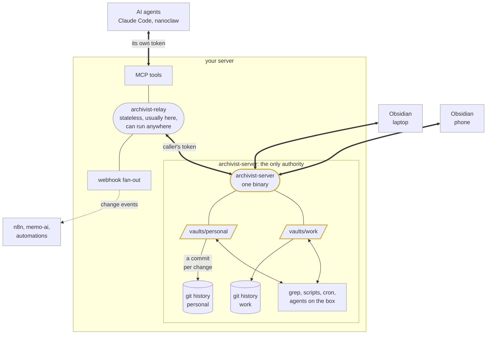

# Archivist

Keep using Obsidian. Keep your notes as ordinary files on your own server.

Obsidian is a good editor and a bad place to keep the only copy of a decade of
thinking. Its own sync is a subscription; the self-hosted options each give up
plain files, real-time sync, or mobile.

Archivist is a small Go server and an Obsidian plugin. Your vault lives on the
server as plain Markdown, images and PDFs in a normal directory, and Obsidian on
your laptop and phone syncs against it in the background.

| Piece | What it does |
| --- | --- |
| `archivist-server` | owns the vault, keeps the history |
| `archivist` | the Obsidian plugin: syncs your laptop and phone |
| `archivist-relay` | optional: MCP tools, webhooks, a friendlier API |

The relay is only needed when a tool cannot reach the server's directory
directly.

## Why that matters

The directory on the server is not a cache or an export. It is the vault, so
anything else on that machine works on the same files: `rg` over them, a script
or an agent editing them, a web viewer serving them, your usual backup taking
them. None of it needs an integration or a second copy.

Archivist watches that directory, commits every change to git, and syncs it to
your devices.

## How it flows



Thick lines carry vault traffic over HTTP. Thin lines are ordinary file I/O on
the server. Dotted lines are optional.

## Caveats

**Single user.** No accounts, no sharing, no self-service. Tokens are per
device, carry read/write/delete scopes and a vault list, and their label lands
in the commit history, so you can tell devices apart. There is just no user
above them: whoever has shell access on the server administers everything.

**Not for the public internet.** It expects Tailscale, a VPN, or a private
network. No rate limiting, lockout or audit log.

**Conflicts are resolved, not prevented.** Edit the same lines on two devices
and you get both: the server's stays at the real path, yours lands beside it as
`.conflict-<device>-<fragment>`, opening with a line saying what happened and
both versions marked up against their common ancestor. Binary files, and paths
both sides created independently, get a clean copy instead.

**Direct edits on the server cannot be merged.** A push from Obsidian carries
the version it was based on, so the server can merge it. A program writing
straight into the directory carries nothing, so whatever it saves replaces
what was there and the watcher commits that. History keeps the replaced
version; nothing warns you at the time. Keep server-side editors read-mostly.

**New.** Written in 2026 and used by one person. Keep backups, and test
restoring them.

## Quickstart

One server, one vault, one desktop Obsidian. Every other device is these steps
again.

**1. Run the server.** A binary from [releases](../../releases), or the
`compose.yaml` here.

```bash
export ARCHIVIST_ROOT=~/archivist
mkdir -p "$ARCHIVIST_ROOT/vaults/personal"

export ARCHIVIST_TOKEN=$(openssl rand -hex 32)   # you need this below
archivist-server
```

**2. Install the plugin** through
[BRAT](https://github.com/TfTHacker/obsidian42-brat), since Archivist is not in
the community store. Install BRAT from **Community plugins → Browse**, run
**BRAT: Add a beta plugin for testing**, and paste
`pkronstrom/obsidian-archivist`.

**3. Connect.** In **Community plugins → Archivist → Options**, set the server
URL and token, then **Test connection**. It reports which vault it reached.

Edits now sync a few seconds after you stop typing.

That single token opens every vault. Mint one per device before adding the
second: [minting tokens](docs/OPERATIONS.md#minting-tokens). If the vault you
connect **already has notes** and the server does too, the plugin stops and
asks rather than merging two unrelated vaults
([why](docs/OPERATIONS.md#connecting-a-vault-that-already-has-notes)). While
this repository is private, BRAT also needs a GitHub token with `repo` scope.

### Optional: reach the vault from Claude Code

The relay exposes the vault as MCP tools for agents that are not on the server.
It forwards each caller's own token, so the agent's scopes are what apply.

```bash
archivist-relay -url http://localhost:8090 -token "$ARCHIVIST_TOKEN" -listen :8091

claude mcp add --transport http archivist http://localhost:8091/mcp \
  --header "Authorization: Bearer $AGENT_TOKEN"
```

Thirteen tools appear, from `read_note` to `note_history`. Give the agent a
token without `delete` unless you mean it:
[the tool list](docs/INTEGRATIONS.md#agents-over-mcp).

## Using it

By default Archivist uploads edits a few seconds after you stop typing, and
receives changes from other devices within about a second. That is **Automatic**
mode; *Sync behavior* also offers **Periodic** (a fixed interval) and **Manual**
(the ribbon icon, the *Sync now* command, or when Obsidian regains focus).

Everything below is reachable from the command palette, and from the ribbon on
mobile, where there is no status bar.

### Files that never sync

Anything marked `.local` stays on the device that made it:

| Name | Effect |
|---|---|
| `Scratch.local.md` | a file, marked before its extension |
| `Journal.local/` | a folder; nothing inside it syncs |
| `Notes/Plan.local` | a file with no extension |

Remove the `.local` and it starts syncing as a new note. A folder must *end* in
`.local`, so `project.local.assets` is ordinary and syncs.

### The revision browser

A history icon in the status bar, scoped to the note you have open. On mobile it
is *Archivist: Show versions* in the ribbon, and *Browse revisions of this note*
in the command palette.

It groups revisions into editing sessions rather than listing every commit.
Clicking one writes that version beside the note as `Note.ae56b1c.local.md` and
opens it; remove the `.local` to keep it. There is no in-place restore, which is
why browsing costs nothing.

**Pins** name a version worth keeping. They live in `pins.jsonl` in the vault
root, so they sync and survive history rewrites. A pin marks the current state.

### Recovering a deleted note

Deleting a note removes its path, not its history.

**Settings → History and recovery → Deleted notes** lists what the server still
holds, grouped by the folder each came from. Restoring puts the file back where
it was. Tick *Open a local-only copy instead of restoring* to read one first
without it syncing.

Restoring never overwrites, and moved notes are filtered out, so you cannot end
up with two copies of a note that was only renamed. On the server the same list
is `archivist-server deleted -name personal`, with the `restore` command per row.

Making something actually unrecoverable is a different job:
[reclaim](docs/OPERATIONS.md#reclaiming-space).

### Syncing plugin settings

A plugin's `data.json` often holds an API key, so it is scanned before syncing.
Enable plugins one at a time, or turn on *Sync settings for all plugins* and
everything syncs except what the scan flags. The scan also runs at the push, so
the blanket setting cannot send a credential nobody looked at. It is
best-effort and cannot recognise every secret.

### From the command line

```bash
export ARCHIVIST_ROOT=~/archivist

archivist-server history -name personal notes/idea.md
archivist-server deleted -name personal
archivist-server show -name personal notes/idea.md 4f3538ca
archivist-server restore -name personal notes/idea.md 4f3538ca
archivist-server check -name personal        # non-zero on drift
```

`GET /personal/v1` lists every HTTP endpoint, generated from the table that
builds the routes.

## Common tasks

| I want to | Where |
| --- | --- |
| get back a note I deleted | [Recovering a deleted note](#recovering-a-deleted-note) |
| go back to an earlier version | [the revision browser](#the-revision-browser) |
| keep a note on one device only | [Files that never sync](#files-that-never-sync) |
| mark a version worth keeping | pins, in [the revision browser](#the-revision-browser) |
| understand a `.conflict-` file | [Caveats](#caveats) |
| add another device | [minting tokens](docs/OPERATIONS.md#minting-tokens) |
| let an agent read and write notes | [agents over MCP](docs/INTEGRATIONS.md#agents-over-mcp) |
| require a code before a vault opens | [protecting a vault](docs/OPERATIONS.md#protecting-a-vault) |
| keep work and personal apart | [more than one vault](docs/OPERATIONS.md#more-than-one-vault) |
| start from a vault that already has notes | [connecting an existing vault](docs/OPERATIONS.md#connecting-a-vault-that-already-has-notes) |
| run something when a note changes | [reacting to changes](docs/INTEGRATIONS.md#reacting-to-changes) |
| sync Obsidian's own settings and plugins | [Obsidian config](docs/INTEGRATIONS.md#syncing-obsidians-own-config) |
| stop the same note arriving twice | [the same note appearing twice](docs/OPERATIONS.md#the-same-note-appearing-twice) |
| work out why sync looks wrong | [when sync looks wrong](docs/OPERATIONS.md#when-sync-looks-wrong) |
| remove a huge file or a leaked secret from history | [reclaiming space](docs/OPERATIONS.md#reclaiming-space) |
| reach the server from another machine | [reaching it from elsewhere](docs/OPERATIONS.md#reaching-it-from-elsewhere) |
| back the whole thing up | [backups](docs/OPERATIONS.md#backups) |

## Alternatives

| | Cost | Server copy | Real-time | Mobile |
| --- | --- | --- | --- | --- |
| **Obsidian Sync** | subscription | none, hosted | yes | built in |
| **Self-hosted LiveSync** | free | a projection of a CouchDB, ~4× disk | yes | plugin |
| **Obsidian Git** | free | a git checkout | no, on a timer | limited on iOS |
| **Syncthing** | free | plain files | yes | no iOS client |
| **Archivist** | free | **plain files, 1×** | yes | plugin |

## Documentation

| Doc | Covers |
| --- | --- |
| [Running a server](docs/OPERATIONS.md) | tokens, multiple vaults, TOTP-protected vaults, exposing it beyond localhost, write guards, reclaiming space, backups |
| [Other tools](docs/INTEGRATIONS.md) | MCP for agents, webhooks, editing on the server, syncing Obsidian's own config |
| [Internals](docs/INTERNALS.md) | how sync, merging and the git layer actually work |
| [Design notes](docs/) | why things are the way they are, including the ideas that were rejected |
