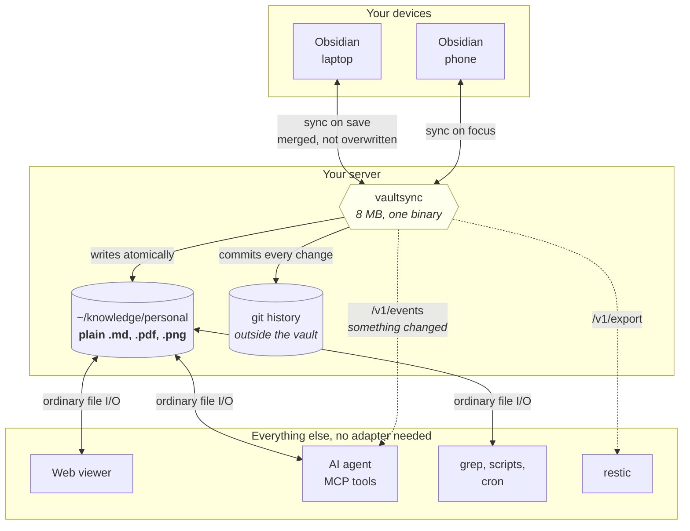

# vaultsync

Keep using Obsidian. Keep your notes as ordinary files on your own server.

Obsidian is a good editor and a bad place to store the only copy of a decade of
thinking. Its own sync is a subscription, and the self-hosted alternatives all
ask for something back: the server copy stops being ordinary files, or sync is
not real-time, or mobile is unreliable, or your vault ends up stored three times
over.

vaultsync is one small Go binary and one Obsidian plugin. Your vault lives on
your server as **plain Markdown, images and PDFs in a normal directory** — the
real thing, not an export — while Obsidian on your laptop and phone syncs against
it in the background.

## Why that matters

Because a directory of files is useful to everything else you own.

```bash
grep -ri "that idea from 2019" ~/knowledge/personal
```

Point a web viewer at it. Let an AI agent read and write notes in it. Run a
script over it. Serve it. Back it up with the same tool as everything else. None
of that needs an adapter, an API client, or an export step, because there is
nothing to adapt — they are just files.

Every change is committed to git, so you get history and point-in-time restore
for free, and can recover a note you mangled three weeks ago.

## How it flows



The dotted lines are optional. The solid line from the vault to everything else
is the point: those tools are reading files, not calling an API.

## What this is good for

**Capture anywhere, file it later.** Jot into a capture app on your phone; a
small job on the server writes the keepers into `Inbox/` as Markdown. Your
laptop has them the next time you open Obsidian.

**Let an AI agent actually use your notes.** An agent on the server reads and
writes the vault as files — no API client, no export, no sync SDK. It can answer
"what did I decide about X in 2019" by grepping, and file its own notes back
into the vault where you will see them on your phone.

**React to changes.** Subscribe to `/v1/events`, and when a note changes,
re-embed it, update an index, run a linter, post to a channel. The cursor in
`/v1/changes` means a consumer that was down for a week catches up correctly.

**Read your notes on the web** without another sync system. Point any viewer at
the directory. Read-only is safest, since server-side edits cannot be merged.

**Generate notes from scripts.** A cron job writing a daily note, a job pulling
in your calendar, a script filing receipts. Write a file, and it is on your
phone a second later.

**Search across everything, with normal tools.** `grep`, `rg`, `fzf`, and every
Unix thing you already know, over the actual files.

**Keep history without thinking about it.** Every change is a commit, so
"restore the version from before I deleted half of it" is always available.

## Philosophy

**Small enough to read in an afternoon.** ~3,000 lines across both halves. If it
grows past what one person can hold in their head, it has failed at its purpose.

**One static binary. No database, no dependencies.** The container image is
`FROM scratch` and 8 MB. Nothing to install on the server, nothing to keep
running alongside it.

**The server-side files are real and yours to modify.** Edit them with anything.
The changes sync back to your devices.

**Boring where it counts.** Git stores the history. Standard three-way merge
resolves conflicts. Content is addressed by git's own object hash, so you can
verify it with `git hash-object`.

## Caveats — read these before trusting it

**Single user.** No accounts, no sharing, no permissions. One person, one token
per vault.

**Not for the public internet.** It expects to sit behind Tailscale, a VPN, or
a private network. There is one bearer token and no rate limiting, lockout, or
audit log.

**Conflicts are resolved, not prevented.** Edit the same lines on two devices and
you get both versions — the server's, plus yours in a `.conflict-<device>-<time>`
file next to it. Nothing is lost, but you resolve it by hand.

**Editing on the server is last-writer-wins.** A push from Obsidian carries a
base version, so it can be merged. A program writing directly to the directory
does not, so if you leave a note open in a web editor for a day and then save,
it overwrites what your phone wrote. Git history has the overwritten version,
but nothing warns you. Keep server-side editors read-mostly.

**It is new.** Written in 2026, used by one person. It is well tested, including
against the real thing rather than mocks — but you should keep backups you have
actually tried restoring, which is true of any sync tool and especially this one.

## Alternatives

| | Cost | Server copy | Real-time | Mobile |
| --- | --- | --- | --- | --- |
| **Obsidian Sync** | subscription | none — hosted | yes | excellent |
| **Self-hosted LiveSync** | free | a projection of a CouchDB, ~4× disk | yes | good |
| **Obsidian Git** | free | a git checkout | no — on a timer | poor on iOS |
| **Syncthing** | free | plain files | yes | no iOS client |
| **vaultsync** | free | **plain files, 1×** | yes | good |

**Obsidian Sync** is the right answer if you want it to just work and do not
care where the notes live. It is genuinely excellent.

**Self-hosted LiveSync** is the mature self-hosted option and does more than
this: end-to-end encryption, peer-to-peer, several storage backends. Choose it
if you want a project with many users behind it. The trade is that CouchDB is
the real store and the filesystem copy is a projection maintained by a separate
daemon — measured at about 4× the vault size across the three copies, and the
server cannot arbitrate conflicts because every client is a full replica.

**Obsidian Git** is the closest in spirit and the simplest thing that works. It
syncs on a timer rather than on save, every device carries the full history, and
iOS support is its weakest point.

**Syncthing** is excellent and has no iOS client, which ends the discussion if
you have an iPhone.

## Getting started

Server — grab a binary from [releases](../../releases) or run the container:

```bash
VAULTSYNC_TOKEN=$(openssl rand -hex 32) \
  vaultsync -vault ~/knowledge/personal -git ~/vaultsync/git
```

Plugin — install [BRAT](https://github.com/TfTHacker/obsidian42-brat) from
Community Plugins, add `pkronstrom/vaultsync` as a beta plugin, then set the
server URL and token in vaultsync's settings and press **Test connection**.

Two vaults means two of everything: two containers, two tokens, two hostnames.
They share nothing.

## Hooking things up to it

Because every change is a commit, **history is already a durable event feed**.
Anything that wants to react to edits — an indexer, an AI agent, a webhook
bridge — stores a cursor and asks what it missed:

```bash
curl -s -H "$AUTH" "https://vault.example/v1/changes?since=$CURSOR"
```

That works however long the consumer was away, so there is nothing to queue and
no backlog to manage.

For low latency, subscribe to the change stream:

```bash
curl -N -H "$AUTH" https://vault.example/v1/events
data: {"head":"4ff143d6..."}
```

It carries a **notification, not the change** — "something moved, go look". A
missed event costs nothing, because the cursor still says what changed. Use the
stream to know *when*, and `/v1/changes` to know *what*.

An agent running on the same machine needs none of this. The vault is a
directory; read and write the files and the server notices within a second.

## Backups

```bash
curl -sf -H "Authorization: Bearer $TOKEN" https://vault.example/v1/export \
  | restic backup --stdin --stdin-filename vault.tar
```

Do not back up the git directory with a file-level tool while the server is
running — you can capture a half-written state. The export exists to avoid that.

## More

[Internals](docs/INTERNALS.md) — protocol, guarantees, and the measurements
behind the design decisions.

MIT.
