# Archivist

Keep using Obsidian. Keep your notes as ordinary files on your own server.

Obsidian is a good editor and a bad place to keep the only copy of a decade of
thinking. Its own sync is a subscription; the self-hosted options each give up
plain files, real-time sync, or mobile.

Archivist is a small Go server and an Obsidian plugin. Your vault lives on your
server as **plain Markdown, images and PDFs in a normal directory**, the real
thing rather than an export, while Obsidian on your laptop and phone syncs
against it in the background.

| Piece | What it does |
| --- | --- |
| `archivist-server` | owns the vault, keeps the history |
| `archivist` | the Obsidian plugin: syncs your laptop and phone |
| `archivist-relay` | optional: MCP tools, webhooks, a friendlier API |

The relay is only needed when a tool cannot reach the server's directory
directly.

## Why that matters

The directory on the server is not a cache or an export. It is the vault:
ordinary Markdown, images and PDFs.

Anything else on that machine works on the same files. Search them with `rg`,
edit them from a script or an agent, serve them with a web viewer, back them up
with everything else. None of it needs an Archivist integration or a second
copy.

Archivist watches the directory, commits each change to git, and syncs it to
your devices.

## How it flows



<sub>Source and regeneration: [`docs/diagrams/`](docs/diagrams/).</sub>

Thick lines carry vault traffic over HTTP. Thin lines are ordinary file I/O on
the server. Dotted lines are optional.

## Caveats

**Single user.** No accounts, no sharing, no identity model. Tokens are minted
per device and carry read/write/delete scopes and a vault list, but they say
what a device may do, not who anyone is.

**Not for the public internet.** It expects to sit behind Tailscale, a VPN, or
a private network. There is no rate limiting, lockout or audit log.

**Conflicts are resolved, not prevented.** Edit the same lines on two devices and
you get both versions: the server's, plus yours in a `.conflict-<device>-<fragment>`
file next to it. Where a three-way merge was possible that parked file contains
git-style conflict markers rather than a clean copy. Nothing is lost, but you
resolve it by hand.

**Editing on the server is last-writer-wins.** A push from Obsidian carries a
base version, so it can be merged. A program writing directly to the directory
does not, so if you leave a note open in a web editor for a day and then save,
it overwrites what your phone wrote. Git history has the overwritten version,
but nothing warns you. Keep server-side editors read-mostly.

**New.** Written in 2026 and used by one person. Keep backups, and test
restoring them.

## Getting started

**Server.** Grab a binary from [releases](../../releases), or build the image
from the `Dockerfile`.
A vault is a directory under `$ARCHIVIST_ROOT/vaults/`:

```bash
export ARCHIVIST_ROOT=~/archivist
mkdir -p "$ARCHIVIST_ROOT/vaults/personal"

export ARCHIVIST_TOKEN=$(openssl rand -hex 32)
archivist-server                       # serves every vault under $ARCHIVIST_ROOT
```

That single token opens every vault, which is fine to start with and the server
warns about it. For real use, mint one per device: see
[OPERATIONS](docs/OPERATIONS.md#minting-tokens).

**Plugin.** Archivist is not in the community plugin store, so it installs
through [BRAT](https://github.com/TfTHacker/obsidian42-brat), which tracks a
GitHub repository and keeps the plugin updated from its releases.

1. **Community plugins → Browse**, search **BRAT**, install and enable it.
2. Run **BRAT: Add a beta plugin for testing** from the command palette (or
   *BRAT settings → Add beta plugin*).
3. Paste `pkronstrom/obsidian-archivist`, leave the version as **latest**, and
   confirm. Leave *Enable after installing* ticked.
4. **Community plugins → Archivist → Options**, set the server URL and token,
   and press **Test connection**.

Repeat on every device, phone included: BRAT works the same on mobile.

While this repository is private, BRAT also needs a GitHub personal access
token with `repo` scope, set in its settings. That requirement goes away when
the repository is public.

To update later, run **BRAT: Check for updates to all beta plugins**, or turn on
*Auto-update plugins at startup*. If an update does not arrive, check that the
version has a release attached and that BRAT still lists the repository; it can
drop the link silently.

If the vault you are connecting **already has notes** and the server does too,
the plugin stops and asks rather than merging two unrelated vaults. That is
deliberate; the choices are explained in
[OPERATIONS](docs/OPERATIONS.md#connecting-a-vault-that-already-has-notes).

## Using it

By default Archivist uploads edits a few seconds after you stop typing, and
receives changes from other devices within about a second. That is **Automatic**
mode; *Sync behavior* also offers **Periodic** (a fixed interval) and **Manual**
(the ribbon icon, the *Sync now* command, or when Obsidian regains focus).

Everything below is reachable from the command palette, and from the ribbon on
mobile, where there is no status bar.

### Files that never sync

**Anything marked `.local` stays on the device that made it.** Never uploaded,
by either side:

| Name | Effect |
|---|---|
| `Scratch.local.md` | a file, marked before its extension |
| `Journal.local/` | a **folder**; nothing inside it ever syncs |
| `Notes/Plan.local` | a file with no extension, same idea |

Use it for scratch notes, machine-specific captures, a whole working folder, or
anything you do not want on your phone. Rename without the `.local` part and it
starts syncing immediately, as new notes.

A folder has to *end* in `.local` to count, so `project.local.assets` is an
ordinary folder and everything in it syncs. Otherwise a naming coincidence
could hide a whole tree.

The revision browser writes its copies into this namespace, which is why
browsing an old version never reaches your other devices.

### In Obsidian: the revision browser

The status bar carries a history icon scoped to the note you are looking at,
and on mobile the same thing is *Archivist: Show versions* in the ribbon.
It groups revisions into **editing sessions** rather than listing every commit.
A vault commits whenever you pause, so one evening's drafting is otherwise
twenty entries that all say the same thing.

Clicking a session writes that version **beside** the note as
`Note.ae56b1c.local.md` and opens it. Nothing is overwritten, and there is no
"restore" button anywhere. To bring an old version back, remove `.local` from
the copy's filename; it then syncs as a new note.

**Pins** name a version worth keeping: "draft sent to Anna", or a marker before
a big reorganisation. They are lines in `pins.jsonl` in your vault
root, so they sync, merge and survive history rewrites like any other note. A
pin always marks the current state; to keep an old version, open it first, then
pin that.

### Recovering a deleted note

Deleting a note removes its path, not its history. Archivist can list deleted
notes even when you no longer remember their filenames.

**Settings → History and recovery → Deleted notes → Browse deleted** lists them, newest first,
with who deleted each and when. Restoring writes the file back where it was and
it syncs like any new note. On the server, `archivist-server deleted` prints the
same list along with the exact `restore` command for each row.

Entries are grouped by the folder they were deleted from.

**Preview without restoring.** Tick *Open a local-only copy instead of restoring*
and the note is written as a `.local` file at the vault root instead: you can
read it, and it never syncs anywhere. It lands at the root rather than its
original folder because that folder is often gone too, and rebuilding a
directory tree for a copy you may discard would recreate what you deleted.

Restoring never overwrites: if something now lives at that path, the note was
re-created since and the restore is refused rather than destroying the newer
version to recover the older one. Moves are filtered out, since a moved note
was never lost and "restoring" it would leave you with two copies.

If you want something actually gone, this is not the feature. That needs
`reclaim`, which rewrites history and drops the objects.

### Syncing plugin settings

A plugin's `data.json` often holds an API key, so it is scanned before it can
sync. Leave *Sync settings for all plugins* off and enable each plugin
yourself, or turn it on and every plugin syncs except the ones the scan flags.
Either way a flagged plugin needs an explicit decision, and the scan runs again
at the push rather than only in the settings pane, so a blanket default cannot
send a credential nobody looked at. Scanning is best-effort: it reads names and
values it recognises, and cannot recognise everything.

### History from the command line

On the server, without git installed:

```bash
export ARCHIVIST_ROOT=~/archivist          # -name picks the vault under it

archivist-server history -name personal notes/idea.md   # revisions that touched it
archivist-server deleted -name personal                 # notes history holds, the vault does not
archivist-server show -name personal notes/idea.md 4f3538ca
archivist-server restore -name personal notes/idea.md 4f3538ca
archivist-server check -name personal                   # tree versus history; non-zero on drift
```

Or over HTTP. Routes are vault-qualified, so `GET /personal/v1` lists every
endpoint with a one-line description, generated from the same table that builds
the routes.

## Alternatives

| | Cost | Server copy | Real-time | Mobile |
| --- | --- | --- | --- | --- |
| **Obsidian Sync** | subscription | none, hosted | yes | built in |
| **Self-hosted LiveSync** | free | a projection of a CouchDB, ~4× disk | yes | plugin |
| **Obsidian Git** | free | a git checkout | no, on a timer | limited on iOS |
| **Syncthing** | free | plain files | yes | no iOS client |
| **Archivist** | free | **plain files, 1×** | yes | plugin |

## Documentation

| Doc | Covers |
| --- | --- |
| [Running a server](docs/OPERATIONS.md) | tokens, multiple vaults, TOTP-protected vaults, exposing it beyond localhost, write guards, reclaiming space, backups |
| [Other tools](docs/INTEGRATIONS.md) | MCP for agents, webhooks, editing on the server, syncing Obsidian's own config |
| [Internals](docs/INTERNALS.md) | how sync, merging and the git layer actually work |
| [Design notes](docs/) | why things are the way they are, including the ideas that were rejected |
